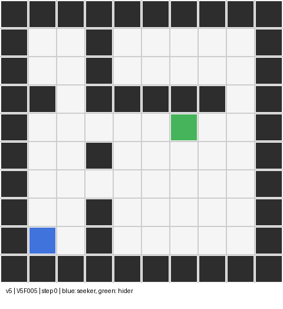
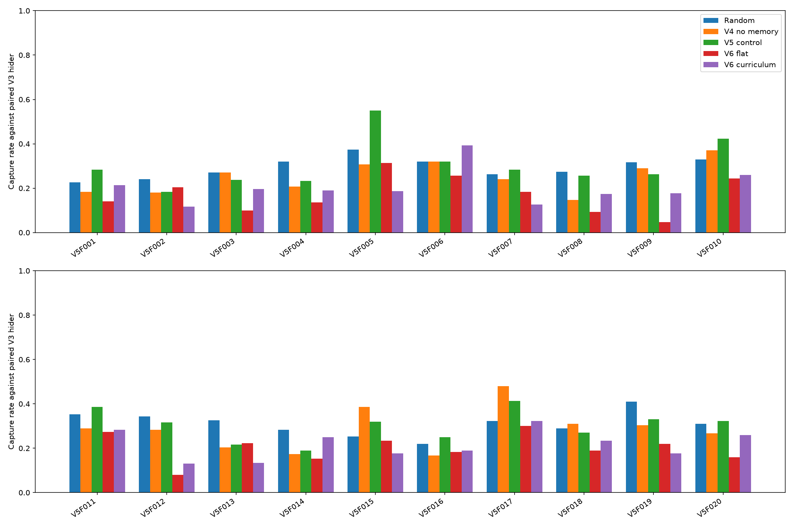

# คู่มือพรีเซนต์ Hide-and-Seek RL

## สรุปในประโยคเดียว

เราสร้างเกมซ่อนหา 2D ที่ AI เล่นได้จริง ฝึกโมเดลทั้งฝ่ายหาและฝ่ายซ่อน เก็บผลทดสอบหลายแผนที่ไว้ครบแล้ว **ระบบทำงาน แต่ AI รุ่นล่าสุดยังหาได้ไม่เก่งบนแผนที่ใหม่**

## ตอนนี้ทำอะไรเสร็จแล้ว

| ส่วนงาน | สิ่งที่เปิดให้ดูได้ | หลักฐาน |
| --- | --- | --- |
| เกม | ห้อง กำแพง การบังสายตา การเดิน จับได้หรือหมดเวลา | [ภาพเกมที่รันจริง](../results/v6_demo_v5_control_v5f005.gif), [ตัวเปิดเกมสด](../evaluation/watch_v6.py) |
| โมเดล | มีไฟล์โมเดล Seeker และ Hider ที่ฝึกแล้ว เลือกเล่น V4, V5, V6 ได้ | โฟลเดอร์ `models/` และคู่มือเปิดเกมด้านล่าง |
| การทดลอง | ฝึกหลาย seed แยกแผนที่ฝึก/ตรวจ/ทดสอบ และบันทึกผลรายเกม | [รายงาน V6](v6_report.md), [กราฟ 20 แผนที่](../results/v6_final_metrics.png) |

โปรเจกต์เริ่มจากเกมพื้นฐาน V1 แล้วเพิ่ม Hider ที่เรียนรู้ ห้อง/กำแพง/การบังสายตา และทดลองปรับ Seeker ไปจนถึง V6 โมเดลที่พัฒนาใหม่ไม่ได้เก่งกว่ารุ่นก่อนทุกครั้ง จึงเก็บผลที่ไม่สำเร็จไว้ในรายงานด้วย

## โมเดลมาจากไหน

**แบบของโมเดล** ใช้ PPO (`MlpPolicy`) จากไลบรารี Stable-Baselines3 แต่ **น้ำหนักที่ใช้เล่นเกมฝึกในโปรเจกต์นี้เอง** โปรแกรมให้ตัวละครเล่นเกมจำลองซ้ำ ๆ แล้วใช้รางวัลจากการจับได้หรือรอดครบเวลาในการปรับน้ำหนัก ไม่มีการนำโมเดลซ่อนหาที่ฝึกสำเร็จจากภายนอกมาใช้ และไม่ได้ฝึกจากคลิปวิดีโอ

| ไฟล์โมเดลที่ใช้โชว์ | ที่มาของน้ำหนัก |
| --- | --- |
| Hider V3 `hider_v3_seed41.zip` | สร้าง PPO ใหม่ แล้วฝึกหนี Seeker ในเกม V3 สลับกับการฝึก Seeker |
| Seeker V3.1 | ฝึกต่อจาก Seeker V3 |
| Seeker V4 | เริ่มจากน้ำหนัก Seeker V3.1 แล้วฝึกต่อบนหลายแผนที่ |
| Seeker V5 และ V6 | **ทั้งคู่เริ่มจาก V4** แล้วแยกทดลองวิธีฝึกของตัวเอง; V6 ไม่ได้ฝึกต่อจาก V5 |

ไฟล์ `.zip` ใน `models/` คือน้ำหนักที่ฝึกแล้วและเปิดเล่นได้ ส่วนไฟล์ `.json` ชื่อเดียวกันบอกแหล่งที่มา seed จำนวนก้าว และคู่แข่ง เช่น [ข้อมูลกำกับ V6 seed 41](../models/seeker_v6_curriculum_seed41.json) ดูขั้นตอนจริงได้ใน [โค้ดฝึก V3](../training/train_v3.py) และ[โค้ดฝึก V6](../training/train_v6.py) โมเดลแต่ละ seed เป็นการฝึกคนละรอบ ไม่ใช่ไฟล์ที่คัดลอกผลเกมจากตาราง

## เดโมที่พร้อมเปิดทันที

**สีฟ้า = ฝ่ายหา (Seeker), สีเขียว = ฝ่ายซ่อน (Hider), สีเทา = กำแพง** ภาพเป็นมุมผู้ชม จึงเห็นทั้งสองฝ่ายแม้ในเกม AI จะมองไม่เห็นกัน

สองภาพต่อไปใช้ **แผนที่เดียวกัน จุดเริ่มเดียวกัน และ Hider ตัวเดียวกัน** เพื่อให้เห็นการเคลื่อนที่ต่างกัน ตัวอย่างเกมหนึ่งรอบไม่ใช่หลักฐานว่าโมเดลใดเก่งกว่าโดยรวม

### V5: จับได้ใน 10 ก้าว



### V6: หมดเวลา 100 ก้าวโดยจับไม่ได้


## เปิดเกมสดตอนพรีเซนต์

เปิด Terminal ในโฟลเดอร์โปรเจกต์ แล้วใช้คำสั่งนี้สำหรับเกมแรก:

```bash
cd /home/tawan/lab/hideseek
.venv/bin/python -m evaluation.watch_v6 --model v5 --map V5F005 --training-seed 41 --episode-seed 840067 --fps 5
```

เปิดเกมที่สองด้วยจุดเริ่มเดิม:

```bash
.venv/bin/python -m evaluation.watch_v6 --model v6-curriculum --map V5F005 --training-seed 41 --episode-seed 840067 --fps 15
```

หน้าต่าง Pygame จะปิดเมื่อจบเกม กดปิดหน้าต่างเพื่อหยุดก่อนเวลาได้ หากเครื่องพรีเซนต์ไม่มีหน้าจอสำหรับรันเกม ให้เปิด GIF สองภาพด้านบนแทน

## สไลด์ผลที่ควรแสดงต่อจากเกม



บน 20 แผนที่ใหม่ที่แยกไว้ทดสอบ ฝ่ายหา V6 จับได้ **20.9%** ส่วนฝ่ายหาที่เดินสุ่มจับได้ **30.2%** แสดงว่าเกมและการทดสอบทำงานครบ แต่ความสามารถในการค้นหาของ V6 ยังไม่ถึงเป้าหมาย ตัวเลขมาจาก 6,000 เกมต่อวิธี ไม่ใช่จาก GIF ตัวอย่าง

สำหรับฝ่ายซ่อน Hider V3 เคยรอดจากฝ่ายหาที่เดินสุ่ม **66.3%** เทียบกับ Hider สุ่ม **45.0%** บนแผนที่เดิม ([ผล V3](v3_report.md)) แปลว่ามีการเรียนรู้บางส่วน แต่เราไม่ได้ฝึก Hider เพิ่มใน V6 จึงไม่ควรอ้างว่าฝ่ายซ่อนรุ่นล่าสุดเก่งขึ้น

## ลำดับพูดประมาณ 1 นาที

1. “นี่คือเกมซ่อนหา 2D ที่เราสร้างเอง มีห้อง กำแพง และการบังสายตา สีฟ้าเป็นฝ่ายหา สีเขียวเป็นฝ่ายซ่อน” เปิด GIF หรือเกมสด
2. “เราใช้โครงสร้าง PPO จากไลบรารี แล้วฝึกน้ำหนักของฝ่ายหาและฝ่ายซ่อนเองในเกมนี้ ไฟล์ `.zip` คือโมเดลที่ฝึกแล้ว สามารถเปลี่ยนโมเดลแล้วเล่นเกมเดิมซ้ำได้” เปิดตัวอย่าง V5 และ V6 จากจุดเริ่มเดียวกัน
3. “เกมตัวอย่างอย่างเดียวบอกไม่ได้ว่า AI เก่ง เราจึงทดสอบ 6,000 เกมต่อวิธีบน 20 แผนที่ใหม่” เปิดกราฟ
4. “ผล V6 ยังต่ำกว่าการเดินสุ่ม จึงสรุปว่า **ตัวเกม ระบบฝึก และระบบวัดผลใช้งานได้แล้ว แต่ AI ยังต้องพัฒนา** โดยเฉพาะการค้นหาพื้นที่ใหม่”

ถ้าต้องสาธิตแบบไม่พึ่งอินเทอร์เน็ต ใช้โมเดล, GIF, กราฟ และไฟล์ผลที่อยู่ในรีโปนี้ได้ทั้งหมด ไม่ต้องฝึกโมเดลใหม่ระหว่างพรีเซนต์
