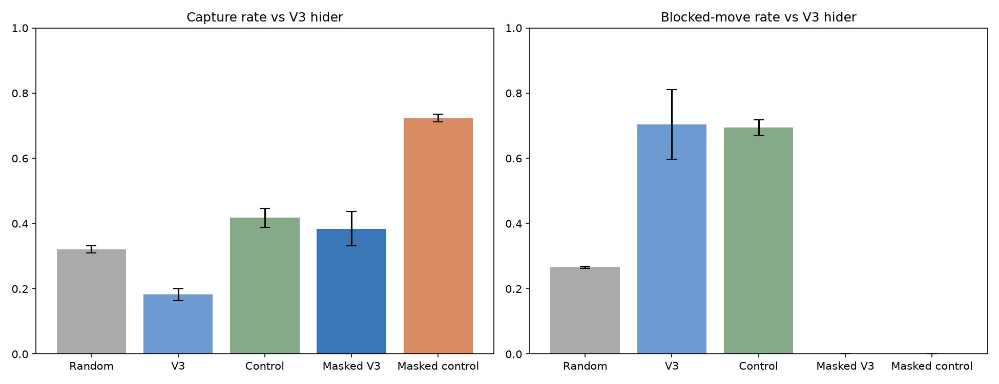

# Hide-and-Seek RL V3.1 — ลดการเดินชนกำแพงของ Seeker

## ปัญหาที่วัดได้

จากโมเดล V3 เดิมบนคู่ Seeker สุดท้าย / Hider V3 จำนวน 900 เกม (training seed 41–43 × eval seed 10000–10099, 20000–20099, 30000–30099) Seeker จับได้ 169 เกม (18.8%) ใน 73,814 ก้าว มีการเลือกทิศที่ติดกำแพงหรือขอบ 53,982 ครั้ง (73.1%) และไปถึงเฉลี่ยเพียง 3.69 ช่องที่ไม่ซ้ำต่อเกม

เกมที่เริ่มโดยเห็น Hider จับได้ 113/276 (40.9%) ส่วนเกมที่เริ่มโดยมองไม่เห็นจับได้ 56/624 (9.0%) ผลนี้ชี้ว่า Seeker มักติดอยู่ในบริเวณเล็ก ๆ เมื่อหาคู่แข่งไม่พบ จึงทดลองแก้พฤติกรรมเดินชนกำแพงก่อน

## วิธีทดลอง

เริ่มทั้งสองชุดจาก Seeker V3 สุดท้ายของ training seed เดียวกัน ใช้ Hider V3 ตัวเดิมที่ตรึงไว้เป็นคู่แข่ง ฝึก PPO ต่อ 100,000 ก้าวที่ร้องขอ (PPO ทำจริง 100,352 ก้าว) ด้วย seed สำหรับการฝึกชุดเดียวกัน

- **Control:** รางวัล V3 เดิม ไม่มีค่าปรับเพิ่ม
- **Wall penalty:** หักเพิ่ม `0.02` เมื่อ Seeker เลือกทิศที่เดินไม่ได้และเกมยังไม่จบ รางวัลจับได้คง `+1` และ observation, แผนที่, กติกาอื่นคงเดิม

โมเดลใหม่เก็บเป็น `models/seeker_v31_{control,penalty}_seed*.zip` พร้อม metadata; log ราย episode อยู่ใน `results/v31_seed*_*_episodes.csv` โมเดลและผล V1–V3 ไม่ถูกเขียนทับ

ทดลองนำร่อง seed 43 โดยฝึกต่อ 50,000 ก้าวและดูผลบน eval seed ชุด V3 เดิม: Control จับ Hider V3 ได้ 35/300 (11.7%) และชนกำแพง 95.8% ของก้าว; Wall penalty จับได้ 104/300 (34.7%) และชนกำแพง 54.6% ผลนำร่องนี้ใช้เลือกแนวทาง จึงไม่ใช้เป็นผลยืนยันสุดท้าย

## ผลทดลองค่าปรับ

ประเมินแบบ action deterministic บนกติกาและรางวัล V3 เดิม ใช้ eval seed ชุดใหม่ 40000–40099, 50000–50099, 60000–60099 รวม 900 เกมต่อคู่ ผลรายเกมอยู่ใน `results/v31_reward_evaluation.csv` และ [กราฟ](../results/v31_reward_metrics.png)

| Seeker / Hider V3 | จับได้ | เดินชนกำแพงหรือขอบ | ช่องที่ไม่ซ้ำเฉลี่ย |
| --- | ---: | ---: | ---: |
| สุ่ม | 288/900 (32.0%) | 26.7% | 15.00 |
| V3 เดิม | 136/900 (15.1%) | 74.6% | 3.48 |
| Control ฝึกต่อ | 347/900 (38.6%) | 68.0% | 4.11 |
| เพิ่มค่าปรับกำแพง | 315/900 (35.0%) | 69.4% | 3.84 |

Control ดีขึ้นจาก V3 เดิมมาก และผลรวมดีกว่าชุดเพิ่มค่าปรับ แม้ระหว่างฝึกชุดเพิ่มค่าปรับจะมี success 100 episode ท้ายสูงกว่าในทั้งสาม seed ค่าปรับ `0.02` จึงไม่ใช่ผลปรับปรุงที่สม่ำเสมอในการประเมินอิสระ

## เลือกทิศที่เดินได้ก่อนลงมือ

ทดลองอีกวิธีโดย **ไม่ฝึกโมเดลเพิ่ม**: อ่านความน่าจะเป็นของ 4 action จาก PPO แล้วเลือก action ที่มีความน่าจะเป็นสูงสุดเฉพาะในทิศที่เดินได้ ข้อมูลทิศที่เดินได้คำนวณจากตำแหน่งตัวเองและแผนที่กำแพงใน observation เท่านั้น ไม่ใช้ตำแหน่ง Hider ที่ถูกซ่อน วิธีนี้เปลี่ยนการเลือก action ตอนเล่น แต่ไม่เปลี่ยนสนามหรือโมเดลที่บันทึกไว้

หลังทดลองนำร่อง seed 43 จึงใช้ eval seed ใหม่อีกชุด 70000–70099, 80000–80099, 90000–90099 รวม 900 เกมต่อคู่ ผลรายเกมอยู่ใน `results/v31_masked_evaluation.csv` และ [กราฟ](../results/v31_masked_metrics.png) แถบความคลาดเคลื่อนในกราฟเป็นส่วนเบี่ยงเบนมาตรฐานระหว่าง training seed 3 ชุด

| Seeker / Hider V3 | จับได้ | เดินชนกำแพงหรือขอบ | ช่องที่ไม่ซ้ำเฉลี่ย |
| --- | ---: | ---: | ---: |
| สุ่ม | 289/900 (32.1%) | 26.5% | 15.18 |
| V3 เดิม | 164/900 (18.2%) | 70.6% | 3.78 |
| Control ฝึกต่อ | 376/900 (41.8%) | 69.5% | 4.09 |
| Control ฝึกต่อ + เลือกทิศที่เดินได้ | **651/900 (72.3%)** | **0.0%** | 6.61 |

Control ที่เลือกเฉพาะทิศเดินได้จับ Hider V3 ได้ 215/300, 222/300, 214/300 ตามลำดับ training seed 41, 42, 43 เทียบกับ Seeker สุ่ม 95/300, 101/300, 93/300 ใน seed เดียวกัน เมื่อเริ่มเกมโดยมองไม่เห็น Hider วิธีที่เลือกนี้จับได้ 352/594 (59.3%) เทียบกับ Seeker สุ่ม 85/594 (14.3%) และ Control ที่ไม่กรองทิศ 107/594 (18.0%) เมื่อเจอ Hider สุ่ม วิธีที่เลือกนี้จับได้ 828/900 (92.0%)

การกรองทิศอย่างเดียวบนโมเดล V3 เดิมจับ Hider V3 ได้ 346/900 (38.4%) จึงเห็นว่าทั้งการฝึกต่อและการเลือกทิศที่เดินได้มีส่วนต่อผลสุดท้าย ผลนี้ยังไม่ได้พิสูจน์ความสามารถบนแผนที่หรือ Hider แบบใหม่

[ภาพเคลื่อนไหวตัวอย่าง](../results/v31_demo_capture.gif) แสดงรอบที่ Seeker เริ่มโดยมองไม่เห็น Hider และจับได้ใน 14 ก้าว ผู้ชมเห็นตำแหน่งทั้งสองฝ่าย; ข้อความ `visible`/`hidden` ด้านบนระบุสิ่งที่ Seeker มองเห็นจริง เปิดหน้าต่างเกมรอบนี้ด้วย `python -m evaluation.watch_v31`

## ข้อจำกัด

- ทดลองบนแผนที่ V3 แบบเดียว ยังไม่ยืนยันการเล่นบนแผนที่ใหม่
- Hider V3 ถูกตรึงระหว่างฝึกต่อ จึงอาจเกิดการปรับตัวเฉพาะกับคู่แข่งชุดนี้
- การเทียบ V3 กับ V3.1 มีจำนวนก้าวฝึกต่างกัน; ใช้ Control ที่ฝึกต่อเท่ากันเพื่อแยกผลของค่าปรับ
- นโยบายที่เลือกทิศเดินได้ยังไม่มีความจำช่องที่เคยผ่าน และไปถึงเฉลี่ย 6.61 ช่องต่อเกม ต่ำกว่า Seeker สุ่ม 15.18 ช่อง การทดสอบแผนที่ใหม่และการเพิ่มความจำการสำรวจเป็นขั้นถัดไป
