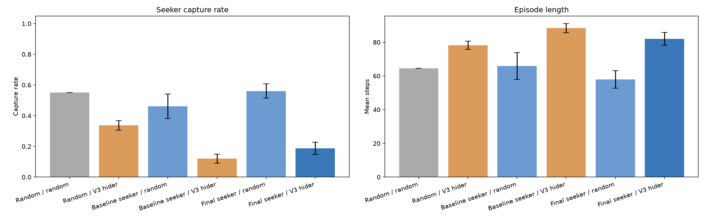

# Hide-and-Seek RL V3 — บันทึกการทดลอง

## เป้าหมาย

V3 เพิ่มห้อง กำแพง และการบังสายตา เพื่อให้ทั้งสองฝ่ายต้องตัดสินใจจากข้อมูลที่เห็นจริงในแต่ละก้าว โมเดล V1/V2 และผลทดลองเดิมถูกเก็บแยกไว้ สนาม V3 ใช้ observation คนละรูปแบบ จึงเริ่มฝึกโมเดลใหม่ทั้งหมด

## สนามและกติกา

สนามเริ่มต้นเป็นตาราง 10 × 10 (`#` คือกำแพง, `.` คือช่องเดินได้) ทุกช่องเดินได้เชื่อมถึงกัน มีเวลา 100 ก้าวต่อเกม และสุ่มจุดเริ่มของผู้เล่นสองฝ่ายในช่องที่ไม่ซ้ำกัน

```text
##########
#...#....#
#...#....#
#........#
#...#....#
###.######
#........#
#....#...#
#....#...#
##########
```

Action 4 ค่าเรียง `ขึ้น, ลง, ซ้าย, ขวา`; เดินชนกำแพงหรือขอบแล้วอยู่ที่เดิม Seeker เดินก่อน Hider และจับได้ทันทีเมื่อเข้าช่อง Hider สายตาลากระหว่างจุดกลางช่อง: กำแพงขวางสายตา รวมกรณีมองเฉียงผ่านมุมกำแพง ทั้งสองฝ่ายรู้แผนที่กำแพง แต่เห็นตำแหน่งคู่แข่งเฉพาะเมื่อมีแนวสายตาถึงกัน

Observation เป็นเวกเตอร์ 105 ค่า ได้แก่ตำแหน่งตัวเอง 2 ค่า, ตำแหน่งคู่แข่ง 2 ค่า, ธงมองเห็น 1 ค่า และแผนที่กำแพง 100 ค่า ตำแหน่งปรับสเกลเป็น 0–1 และตำแหน่งคู่แข่งเป็นศูนย์เมื่อมองไม่เห็น ค่า `distance` ใน `info` เป็น `-1` ในกรณีนั้น รางวัล Seeker คือ `+1` เมื่อจับได้, `-1` เมื่อหมดเวลา, `-0.01` ระหว่างทาง; Hider ได้ค่าเครื่องหมายตรงข้าม (`-1`, `+1`, `+0.01`)

## วิธีฝึกและประเมิน

ใช้ PPO `MlpPolicy` ของ Stable-Baselines3, rollout 512 และ batch size 64 ฝึกแยกกัน 3 training seed: 41, 42 และ 43 ในแต่ละ seed เริ่มจาก Seeker ใหม่กับ Hider สุ่ม 100,000 ก้าว แล้วฝึก Hider กับ Seeker ที่ตรึงไว้ 50,000 ก้าว และ Seeker กับ Hider ที่ตรึงไว้ 50,000 ก้าว สลับกัน 2 รอบ บันทึก log ราย episode และโมเดล baseline/สุดท้ายแยกตาม seed

ประเมินแบบ action deterministic ด้วย seed ที่ไม่ใช้ฝึก 3 กลุ่ม: 10000–10099, 20000–20099, 30000–30099 ต่อ training seed ทั้ง 6 คู่ใช้จุดเริ่มเดียวกันเมื่อ eval seed ตรงกัน กลุ่มละ 100 episode ต่อคู่ต่อ training seed หรือ 900 แถวต่อคู่ ข้อยกเว้นคือคู่สุ่ม/สุ่ม ซึ่งไม่มีโมเดลจาก training seed จึงเป็น 300 เกมที่รันซ้ำเหมือนกัน 3 ครั้ง ไม่ใช่ 900 เกมอิสระ ค่าในตารางด้านล่างคืออัตราที่ Seeker จับได้ จำนวนก้าวเฉลี่ยก่อนจบเกม และสัดส่วนก้าวที่ Seeker มองเห็น Hider ระหว่างประเมิน ผลราย episode อยู่ใน `results/v3_evaluation.csv`; กราฟ `results/v3_metrics.png` แสดงค่าเฉลี่ยและส่วนเบี่ยงเบนมาตรฐานของค่าเฉลี่ยระหว่าง training seed

## ผลการทดลอง

PPO ฝึกตามจำนวน rollout จริง: Seeker baseline 100,352 ก้าว, Seeker สุดท้าย 200,704 ก้าว และ Hider สุดท้าย 100,352 ก้าวต่อ training seed ตารางนี้แสดง success ของ 100 episode สุดท้าย **ระหว่างฝึก**; สำหรับ Hider หมายถึงรอดครบเวลา สำหรับ Seeker หมายถึงจับได้ คู่แข่งเปลี่ยนตามช่วงฝึก ตัวเลขนี้จึงไม่ใช่ผลประเมินอิสระ

| ช่วงฝึก | seed 41 | seed 42 | seed 43 |
| --- | ---: | ---: | ---: |
| Seeker baseline / Hider สุ่ม | 88% | 49% | 51% |
| Hider รอบ 1 / Seeker baseline | 70% | 93% | 85% |
| Seeker รอบ 1 / Hider รอบ 1 | 73% | 79% | 50% |
| Hider รอบ 2 / Seeker รอบ 1 | 59% | 74% | 92% |
| Seeker รอบ 2 / Hider รอบ 2 | 76% | 94% | 83% |

ผลประเมินอิสระ 3 training seed × 300 eval seed ต่อคู่:

| Seeker / Hider | Seeker จับได้ | Hider รอด | ก้าวเฉลี่ย | Seeker เห็น Hider ระหว่างเกม |
| --- | ---: | ---: | ---: | ---: |
| สุ่ม / สุ่ม | 495/900 (55.0%)¹ | 45.0% | 64.56 | 14.9% |
| สุ่ม / Hider V3 | 303/900 (33.7%) | 66.3% | 78.20 | 17.5% |
| Seeker baseline / สุ่ม | 415/900 (46.1%) | 53.9% | 65.89 | 12.4% |
| Seeker baseline / Hider V3 | 108/900 (12.0%) | 88.0% | 88.36 | 25.3% |
| Seeker สุดท้าย / สุ่ม | 505/900 (56.1%) | 43.9% | 57.93 | 10.7% |
| Seeker สุดท้าย / Hider V3 | 169/900 (18.8%) | 81.2% | 82.02 | 27.3% |

¹ คู่สุ่ม/สุ่มมีผลไม่ซ้ำเพียง 165/300 เกม (55.0%) เพราะรัน seed เดียวกันซ้ำสำหรับ training seed ทั้งสาม ค่า 495/900 ใน CSV จึงไม่เพิ่มจำนวนตัวอย่างอิสระ



ภาพเคลื่อนไหวจากโมเดลจริง: [Seeker จับได้ใน 9 ก้าว](../results/v3_demo_capture.gif) และ [Hider รอดครบ 100 ก้าว](../results/v3_demo_hidden.gif) ภาพแสดงตำแหน่งทั้งสองฝ่ายให้ผู้ชมเห็น; ข้อความ `visible`/`hidden` ด้านบนบอกว่า Seeker เห็น Hider ใน observation ของก้าวนั้นหรือไม่

เมื่อเทียบกับ Hider สุ่ม, Hider V3 ลดการถูก Seeker สุ่มจับจาก 55.0% เหลือ 33.7% หรือรอดเพิ่มจาก 45.0% เป็น 66.3% Seeker หลังฝึกสลับดีขึ้นจาก baseline เมื่อเจอ Hider V3 (12.0% เป็น 18.8%) แต่ยังต่ำกว่า Seeker สุ่มที่เจอ Hider V3 (33.7%) เมื่อเจอ Hider สุ่ม Seeker สุดท้ายจับได้ 56.1% ใกล้เคียง Seeker สุ่ม 55.0% จึงยังไม่อาจสรุปว่า Seeker V3 เก่งกว่าการเดินสุ่มอย่างสม่ำเสมอ

ผลแตกต่างระหว่าง training seed มาก: Seeker สุดท้ายจับ Hider V3 ได้ 19.3%, 23.3%, 13.7% ตามลำดับ seed 41, 42, 43 และจับ Hider สุ่มได้ 53.7%, 62.7%, 52.0% กราฟใช้ส่วนเบี่ยงเบนมาตรฐานระหว่างค่าแต่ละ training seed จึงสะท้อนความต่างจากการฝึกสามครั้ง ไม่ใช่ช่วงความเชื่อมั่นของทุก episode

## ข้อจำกัด

- สนามและรูปแบบกำแพงมีแบบเดียว ผลยังไม่ยืนยันการเล่นบนแผนที่ใหม่
- มีเพียง 3 training seed และ Seeker ยังทำได้ไม่ดีเมื่อเจอ Hider ที่ฝึกแล้ว ผลนี้ยืนยันว่า V3 เล่นและฝึกได้ แต่ยังไม่ยืนยันกลยุทธ์ Seeker ที่แข็งแรง
- การมองเห็นกำหนดจากแนวสายตาอย่างเดียว ไม่มีระยะมองสูงสุดหรือความจำตำแหน่งล่าสุด; โมเดลใช้ `MlpPolicy` ไม่ใช่นโยบายแบบมีหน่วยความจำ
- Hider สุ่มเลือกเฉพาะทิศที่เดินได้ ขณะที่โมเดลอาจเลือกทิศชนกำแพงเพื่ออยู่ที่เดิม การเปรียบเทียบจึงมี action distribution ต่างกัน
- Seeker ได้เดินก่อน หากไปถึงช่อง Hider จะจับได้ก่อน Hider ขยับ เช่นเดียวกับ V1/V2
