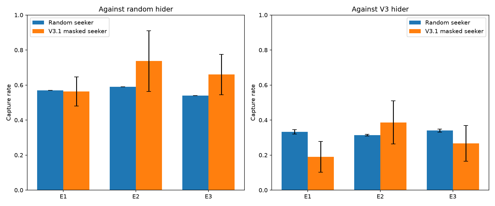
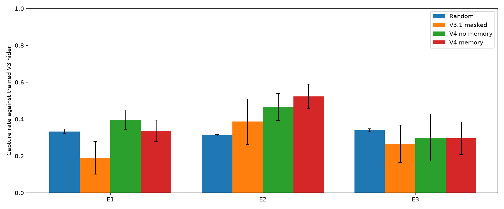
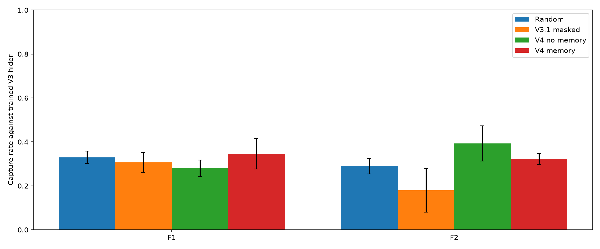

# Hide-and-Seek RL V4 — ทดสอบแผนที่ใหม่และความจำการเดิน

## จุดตั้งต้น

V3.1 Seeker ที่เลือกเฉพาะทิศเดินได้จับ Hider V3 ได้ 651/900 เกม (72.3%) บนแผนที่เดิม แต่ไปถึงเฉลี่ย 6.61 ช่องต่อเกม จึงต้องตรวจว่าเรียนรู้การหา Hider บนแผนที่อื่นด้วยหรือไม่

สร้างแผนที่ 10 × 10 ที่เดินถึงกันทุกช่องว่างและแยกเป็นสามชุดก่อนฝึก V4: แผนที่เดิมร่วมกับ T1/T2 สำหรับฝึก, E1/E2/E3 สำหรับประเมินและเลือกแนวทาง, F1/F2 สำหรับทดสอบครั้งสุดท้าย ไม่มีแผนที่ซ้ำกัน รายละเอียดตัวแผนที่อยู่ใน `env/v4_maps.py`

## ผลก่อนฝึก V4

ประเมิน V3.1 บน E1–E3 ด้วย training seed 41–43 และ eval seed 100000–100099, 110000–110099, 120000–120099 รวม 300 เกมต่อแผนที่ต่อคู่ ทั้ง Seeker และ Hider ใช้นโยบาย deterministic เมื่อต้องใช้โมเดล; Seeker V3.1 ใช้ตัวกรองทิศเดินได้จาก observation ของตัวเอง ผลรายเกมอยู่ใน `results/v4_validation_evaluation.csv`

| คู่แข่งขัน | E1 | E2 | E3 | รวม |
| --- | ---: | ---: | ---: | ---: |
| Seeker สุ่ม / Hider V3 | 100/300 (33.3%) | 94/300 (31.3%) | 102/300 (34.0%) | 296/900 (32.9%) |
| Seeker V3.1 / Hider V3 | 57/300 (19.0%) | 116/300 (38.7%) | 80/300 (26.7%) | 253/900 (28.1%) |
| Seeker สุ่ม / Hider สุ่ม | 171/300 (57.0%) | 177/300 (59.0%) | 162/300 (54.0%) | 510/900 (56.7%) |
| Seeker V3.1 / Hider สุ่ม | 169/300 (56.3%) | 221/300 (73.7%) | 198/300 (66.0%) | 588/900 (65.3%) |

V3.1 แพ้ตัวสุ่มเมื่อเจอ Hider ที่ฝึกแล้วบน E1 และ E3 จึงยังกล่าวไม่ได้ว่าผลบนแผนที่เดิมใช้ได้กับแผนที่ใหม่



## วิธีทดลอง V4

ฝึก Seeker สองแบบจากน้ำหนักนโยบาย V3.1 Control ของ seed เดียวกัน โดยสร้าง PPO และ optimizer ใหม่ให้ทั้งคู่ น้ำหนักรับข้อมูลเดิมเหมือนกันทุกค่า; แบบมีความจำเพิ่มอินพุต 100 ค่า (ช่องที่เคยเดินบนแผนที่ 10 × 10) โดยกำหนดน้ำหนักเชื่อมต่อใหม่เริ่มต้นเป็นศูนย์ จึงให้นโยบายเริ่มต้นตรงกันทั้งสองแบบ

- **ไม่มีความจำ:** observation V3 ขนาด 105 ค่า
- **มีความจำ:** observation V3 105 ค่า ตามด้วย visited map 100 ค่า เริ่มทำเครื่องหมายช่องเกิดและอัปเดตหลังทุกก้าว

ทั้งสองแบบใช้แผนที่ฝึกและ Hider V3 ที่ตรึงไว้ชุดเดียวกัน รับรางวัลเพิ่ม `0.01` เมื่อเข้าช่องใหม่ระหว่างมองไม่เห็น Hider และเกมยังไม่จบ เพื่อแยกผลของ *ข้อมูลความจำ* ออกจากรางวัลนี้ ผลตอบแทนเมื่อจบเกมยังเป็นกติกา V3 เดิม ระหว่างประเมินปิดรางวัลเพิ่มและเลือกเฉพาะทิศที่เดินได้ด้วยข้อมูลตำแหน่งตัวเองและกำแพง

ฝึก seed 41–43 แบบละ 100,000 ก้าวที่ร้องขอ เก็บโมเดล/metadata ใน `models/seeker_v4_{nomemory,memory}_seed*` และ log รายเกมใน `results/v4_seed*_*_episodes.csv` โมเดล V1–V3.1 ไม่ถูกเขียนทับ

PPO รันจริง 100,352 ก้าวต่อ seed ต่อแบบ เพราะเก็บ rollout เป็นช่วง; โมเดลต้นทาง V3.1 มี 301,056 ก้าวก่อนเริ่ม V4 ทั้งสองแบบใช้ optimizer ใหม่เหมือนกันและไม่ย้ายค่า optimizer จาก V3.1 การตรวจนโยบายก่อนฝึกบน observation เดียวกันพบความต่างของความน่าจะเป็น action สูงสุดเป็นศูนย์

## ผลบนชุด E: เลือกแนวทาง

ใช้ eval seed เดียวกับการวัดก่อนฝึก แต่เป็นเกมใหม่สำหรับโมเดล V4 และไม่มีรางวัลสำรวจระหว่างประเมิน ผลรายเกมอยู่ใน `results/v4_models_validation_evaluation.csv`; กราฟแสดงส่วนเบี่ยงเบนมาตรฐานของอัตราจับระหว่าง training seed สามชุด

| Seeker / Hider V3 | E1 | E2 | E3 | รวม | ช่องที่ไม่ซ้ำเฉลี่ย |
| --- | ---: | ---: | ---: | ---: | ---: |
| สุ่ม | 100/300 (33.3%) | 94/300 (31.3%) | 102/300 (34.0%) | 296/900 (32.9%) | 14.63 |
| V3.1 masked | 57/300 (19.0%) | 116/300 (38.7%) | 80/300 (26.7%) | 253/900 (28.1%) | 5.57 |
| V4 ไม่มีความจำ | 119/300 (39.7%) | 140/300 (46.7%) | 90/300 (30.0%) | **349/900 (38.8%)** | 4.98 |
| V4 มีความจำ | 101/300 (33.7%) | 157/300 (52.3%) | 89/300 (29.7%) | 347/900 (38.6%) | 5.68 |

เลือก **V4 ไม่มีความจำ** ก่อนเปิดชุด F เพราะจับได้มากกว่าแบบมีความจำเล็กน้อยในภาพรวมและใช้ observation เดิม ผลต่างเพียง 2 เกมจาก 900 จึงไม่ใช่หลักฐานว่าการไม่มีความจำดีกว่าอย่างมั่นคง แบบมีความจำเดินถึงช่องมากกว่าเล็กน้อย และจับได้ 170/648 เกมที่เริ่มโดยมองไม่เห็น Hider เทียบกับ 160/648 สำหรับแบบไม่มีความจำ แต่ยังต่ำกว่าตัวสุ่มใน E3 ทั้งคู่



## ผลชุด F ที่กันไว้

หลังเลือกแบบไม่มีความจำแล้ว ประเมิน F1/F2 ครั้งเดียวด้วย eval seed 200000–200099 และ 210000–210099 รวม 600 เกมต่อคู่ ไม่มีการปรับโมเดลหรือกติกาหลังดูผล ผลรายเกมอยู่ใน `results/v4_models_test_evaluation.csv`

| Seeker / Hider V3 | F1 | F2 | รวม | ช่องที่ไม่ซ้ำเฉลี่ย |
| --- | ---: | ---: | ---: | ---: |
| สุ่ม | 99/300 (33.0%) | 87/300 (29.0%) | 186/600 (31.0%) | 14.95 |
| V3.1 masked | 92/300 (30.7%) | 54/300 (18.0%) | 146/600 (24.3%) | 6.06 |
| V4 ไม่มีความจำที่เลือก | 84/300 (28.0%) | 118/300 (39.3%) | **202/600 (33.7%)** | 5.67 |
| V4 มีความจำ | 104/300 (34.7%) | 97/300 (32.3%) | 201/600 (33.5%) | 6.25 |

V4 ที่เลือกเหนือกว่า V3.1 และตัวสุ่มในผลรวม แต่ **ยังแพ้ตัวสุ่มบน F1** จึงยังไม่ผ่านเป้าหมายการทำงานสม่ำเสมอทุกแผนที่ แบบมีความจำมีผลรวมแทบเท่ากันและดีกว่าบน F1 แต่ไม่ได้ใช้ผล F เพื่อเปลี่ยนตัวเลือกหลังทดสอบ



## ผลกระทบบนแผนที่เดิม

ตรวจแผนที่เดิมด้วย eval seed ชุดแยก 300000–300099 จำนวน 300 เกมต่อคู่ พบ V3.1 จับได้ 216/300 (72.0%), V4 ไม่มีความจำ 188/300 (62.7%), V4 มีความจำ 162/300 (54.0%) และ Seeker สุ่ม 80/300 (26.7%) ผลรายเกมอยู่ใน `results/v4_models_default_evaluation.csv` การฝึกหลายแผนที่จึงมีต้นทุนด้านผลงานบนแผนที่เดิมในชุดนี้

## ข้อสรุปและข้อจำกัด

- ชุด V4 ที่ฝึกบนหลายแผนที่พร้อมรางวัลช่องใหม่ได้ผลรวมบนแผนที่ใหม่สูงกว่า V3.1 แต่ยังไม่สำรวจได้ทั่ว: V4 ที่เลือกไปถึงเฉลี่ย 5.67 ช่องบน F1/F2 เทียบกับตัวสุ่ม 14.95 ช่อง
- visited map เพิ่มจำนวนช่องที่เดินถึงเล็กน้อย แต่ไม่เพิ่มอัตราจับโดยรวมอย่างชัดเจนใน 3 training seed นี้ จึงยังไม่รับรองว่า “ความจำช่วย”
- ผลต่างระหว่างแผนที่และ seed สูง; F1 แสดงความล้มเหลวของตัวเลือกที่ชนะ validation หากจะใช้จริงควรทดสอบแผนที่และ Hider ที่หลากหลายกว่านี้ โดยคง F1/F2 เป็นผลยืนยันที่เคยเปิดแล้ว ไม่ใช้ปรับแบบย้อนกลับ
- V4 ฝึกเพิ่มจาก V3.1 อีก 100,352 ก้าว จึงแยกผลของการฝึกเพิ่มออกจากผลของแผนที่หลายแบบและรางวัลสำรวจไม่ได้ การเปรียบเทียบแบบมี/ไม่มีความจำใช้จำนวนก้าว แผนที่ คู่แข่ง และรางวัลเท่ากัน จึงตอบเรื่องความจำได้ตรงกว่า
- ผล V4 ชุดหลักทดสอบกับ Hider V3 ที่เคยใช้เป็นคู่แข่งตอนฝึก ยังไม่ได้ทดสอบ V4 กับ Hider ที่ฝึกบนแผนที่ใหม่หรือ Hider ที่เดินสุ่ม
- V4 มี observation 205 ค่าในแบบมีความจำและ 105 ค่าในแบบไม่มีความจำ โมเดลที่บันทึกแยกชื่อจาก V1–V3.1 และการประเมินใช้กติการางวัล V3 เดิม

## ทำซ้ำ

```bash
python -m unittest discover -s tests -q
python -m evaluation.evaluate_v4 --partition validation
python -m training.train_v4
python -m evaluation.evaluate_v4_models --partition validation
python -m evaluation.evaluate_v4_models --partition test
python -m evaluation.evaluate_v4_models --partition default
```
