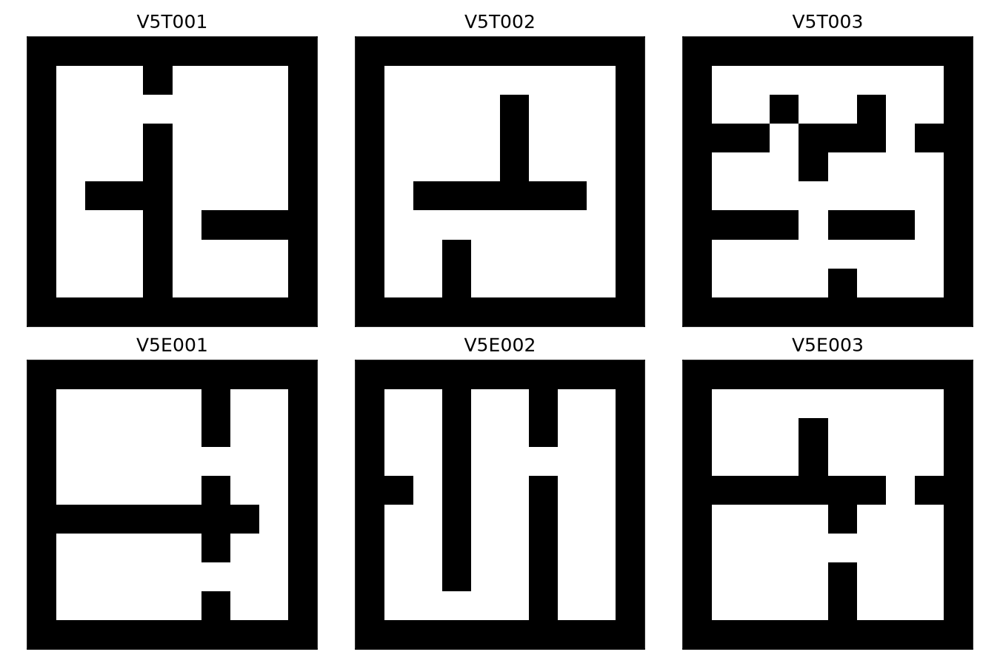
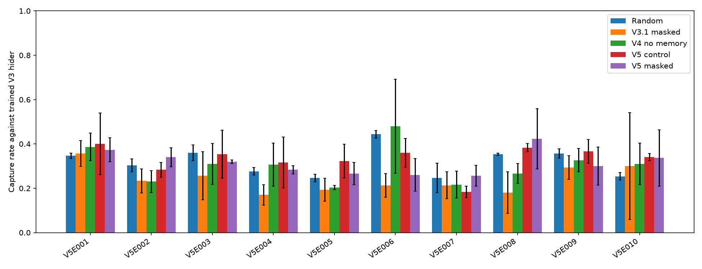
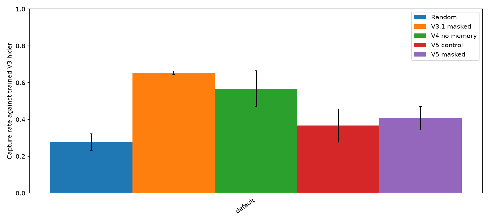
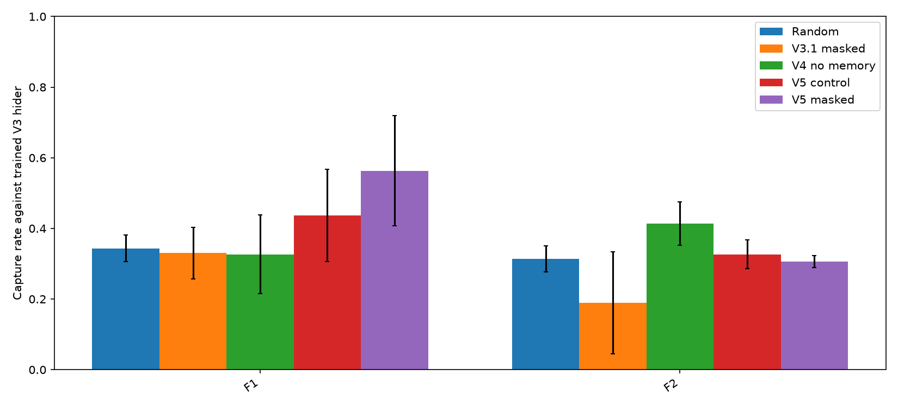

# Hide-and-Seek RL V5 — แผนที่หลากหลายและกรองทิศระหว่างฝึก

## วัตถุประสงค์

V4 แบบไม่มีความจำจับ Hider V3 ได้ 202/600 เกม (33.7%) บน F1/F2 รวมกัน แต่ต่ำกว่า Seeker สุ่มบน F1 และผลบนแผนที่เดิมลดจาก V3.1 จึงทดลองเพิ่มความหลากหลายของแผนที่และตรวจว่าการกรองทิศที่เดินได้ตั้งแต่ระหว่างฝึกช่วยหรือไม่

V5 เป็นการทดลองเปรียบเทียบสองชุด ไม่ใช่การเปลี่ยนโมเดล V1–V4 ที่บันทึกไว้ ชุดทดสอบสุดท้ายของแผนงาน V6 ยังไม่ใช้ในรายงาน V5

## แผนที่และการแยกข้อมูล

`env/v5_maps.py` สร้างแผนที่ห้อง 10 × 10 จาก seed ที่กำหนดไว้ ทุกแผนที่มีทางเดินเชื่อมถึงกันและไม่ซ้ำกับแผนที่ V3/V4 หรือกันเอง

| ชุด | จำนวน | ใช้ทำอะไร |
| --- | ---: | --- |
| V5T | 100 | ฝึก V5 |
| V5E | 10 | ประเมินเพื่อเลือกแนวทาง V5 |
| V5F | 20 | กันไว้สำหรับผลสุดท้าย V6; ไม่ใช้ฝึกหรือเลือก V5 |

ระหว่างฝึกผสม V5T กับแผนที่ V3/V4 ที่เคยเปิดผลแล้ว รวมแผนที่ไม่ซ้ำ 108 แผนที่ ให้แผนที่เดิมและ F1 ปรากฏซ้ำใน pool เพื่อทดสอบว่ารักษาผลงานบนปัญหาที่ V4 พบได้หรือไม่ การซ้ำนี้ใช้เหมือนกันทั้งสองชุด V5



## วิธีทดลอง

เริ่มทั้งสองชุดจากน้ำหนักนโยบาย V4 แบบไม่มีความจำของ training seed เดียวกัน โครงข่ายเริ่มต้นให้ความน่าจะเป็น action ตรงกัน; optimizer ใหม่ทั้งคู่ และฝึกเพิ่มจำนวนก้าวเท่ากันกับ Hider V3 ที่ตรึงไว้ กติกา observation 105 ค่า, รางวัลสำรวจช่องใหม่ `0.01`, ชุดแผนที่, seed และ PPO hyperparameters เหมือนกัน

- **Control:** PPO ปกติระหว่างฝึก; ถ้าเลือกทิศติดกำแพงจะอยู่ที่เดิมตามกติกาเดิม
- **Masked:** MaskablePPO กรองเฉพาะทิศที่เดินได้ระหว่างฝึก โดยคำนวณจากตำแหน่งตัวเองและแผนที่กำแพงใน observation ของ Seeker เท่านั้น

ตอนประเมินทั้งสองแบบเลือกเฉพาะทิศที่เดินได้และปิดรางวัลสำรวจ เพื่อให้ต่างกันที่วิธีฝึก ไม่ใช่กติกาการเล่นตอนประเมิน การตรวจกลไกแยกด้วยโมเดลเริ่มต้นใหม่บนแผนที่เดิม 1,024 ก้าวพบว่า PPO ปกติเลือกทิศที่เดินไม่ได้ 280 ครั้ง ส่วน MaskablePPO เลือก 0 ครั้ง ตัวเลขนี้ใช้ยืนยันการทำงานของ mask ไม่ใช่ผลฝึก V5

ใช้ `sb3-contrib==2.9.0` ที่เข้าคู่กับ Stable-Baselines3 2.9.0 ตาม [เอกสาร MaskablePPO](https://sb3-contrib.readthedocs.io/en/master/modules/ppo_mask.html) และตรึงเวอร์ชันไว้ใน `requirements.txt`

**เกณฑ์อ่านผลที่กำหนดก่อนดูคะแนนเต็ม:** ใช้อัตราจับ Hider V3 บน V5E 10 แผนที่ × 3 training seed × 100 เกมเป็นตัวชี้วัดหลัก แบบ Masked จะถือว่าช่วยได้ก็ต่อเมื่อผลรวมสูงกว่า Control และดีกว่าอย่างน้อย 2 ใน 3 training seed รายงานผลรายแผนที่และเทียบ Seeker สุ่มด้วย ไม่ใช้ผลบนแผนที่เดิมหรือ V5F เพื่อเปลี่ยนตัวเลือกย้อนหลัง

ฝึก seed 41–43 ชุดละ 200,000 ก้าวที่ร้องขอ หรือ 200,192 ก้าวจริงต่อโมเดล โมเดล V4 ต้นทางมี 100,352 ก้าว โมเดล/metadata V5 อยู่ใน `models/seeker_v5_{control,masked}_seed*` และ log ราย episode อยู่ใน `results/v5_seed*_*_episodes.csv`

## ผลบนแผนที่ใหม่ V5E

ประเมินด้วย eval seed 400000–400099 ถึง 490000–490099 ตามลำดับแผนที่ รวม 3,000 เกมต่อคู่ ทั้งสองชุด V5 และ V4/V3.1 ใช้การเลือกทิศที่เดินได้ตอนประเมิน ผลรายเกมอยู่ใน `results/v5_validation_evaluation.csv`

| Seeker / Hider V3 | จับได้ | ช่องที่ไม่ซ้ำเฉลี่ย | seed 41 / 42 / 43 |
| --- | ---: | ---: | ---: |
| สุ่ม | 956/3000 (31.9%) | 15.09 | 326 / 311 / 319 |
| V3.1 masked | 723/3000 (24.1%) | 5.04 | 201 / 255 / 267 |
| V4 ไม่มีความจำ | 911/3000 (30.4%) | 4.94 | 247 / 332 / 332 |
| V5 Control | **993/3000 (33.1%)** | 4.83 | 282 / 356 / 355 |
| V5 Masked | 948/3000 (31.6%) | 5.03 | 330 / 314 / 304 |

Masked สูงกว่า Control เฉพาะ seed 41 และผลรวมต่ำกว่า 45 เกม จึง **ไม่ผ่านเกณฑ์ที่กำหนด** สำหรับการบอกว่ากรองทิศระหว่างฝึกช่วยเพิ่มอัตราจับ แม้ Masked จะไม่เลือกทิศที่เดินไม่ได้ระหว่างฝึก แต่ผลรวมยังต่ำกว่า Seeker สุ่มเล็กน้อย ทั้งสองแบบยังไปถึงช่องน้อยกว่าตัวสุ่มมาก

ผลต่างรายแผนที่สำคัญ: บน V5E006 Seeker สุ่มจับได้ 133/300, Control 108/300 และ Masked 78/300; บน V5E007 Control จับได้เพียง 55/300 เทียบกับตัวสุ่ม 74/300 ผลรวมที่ดูดีขึ้นเล็กน้อยจึงไม่ใช่ความแข็งแรงสม่ำเสมอทุกแผนที่



## ผลบนแผนที่เดิม

ประเมินแผนที่เดิมด้วย eval seed 500000–500099 ต่อ training seed รวม 300 เกมต่อคู่ ค่าทั้งห้าคู่ด้านล่างใช้จุดเริ่มเดียวกันและ Hider V3 ของ seed เดียวกัน ผลรายเกมอยู่ใน `results/v5_default_evaluation.csv`

| Seeker / Hider V3 | จับได้ | ช่องที่ไม่ซ้ำเฉลี่ย |
| --- | ---: | ---: |
| สุ่ม | 83/300 (27.7%) | 16.50 |
| V3.1 masked | 196/300 (65.3%) | 7.15 |
| V4 ไม่มีความจำ | 170/300 (56.7%) | 6.85 |
| V5 Control | 110/300 (36.7%) | 6.26 |
| V5 Masked | 122/300 (40.7%) | 7.01 |

ทั้งสองแบบ V5 ต่ำกว่า V4 และ V3.1 มากบนแผนที่เดิม แม้ Masked จะสูงกว่า Control ในชุดนี้ ผลดังกล่าวเป็นข้อจำกัดสำคัญของการฝึกหลายแผนที่ภายใต้งบ 200,192 ก้าว ไม่ใช้ผลแผนที่เดิมเพื่อเลือกตัวชนะบนชุด V5E



## ตรวจ F1/F2 ที่เคยเปิดผลแล้ว

F1/F2 เป็นแผนที่ทดสอบของ V4 ที่เปิดผลก่อนเริ่ม V5 และนำมาอยู่ในชุดฝึก V5 แล้ว จึงใช้ตรวจพฤติกรรมได้ แต่ **ไม่นับเป็นหลักฐานการทั่วไปสู่แผนที่ใหม่** ประเมินด้วย eval seed ใหม่ 600000–600099 และ 610000–610099 รวม 600 เกมต่อคู่ ผลรายเกมอยู่ใน `results/v5_legacy_evaluation.csv`

| Seeker / Hider V3 | F1 | F2 | รวม |
| --- | ---: | ---: | ---: |
| สุ่ม | 103/300 (34.3%) | 94/300 (31.3%) | 197/600 (32.8%) |
| V3.1 masked | 99/300 (33.0%) | 57/300 (19.0%) | 156/600 (26.0%) |
| V4 ไม่มีความจำ | 98/300 (32.7%) | 124/300 (41.3%) | 222/600 (37.0%) |
| V5 Control | 131/300 (43.7%) | 98/300 (32.7%) | 229/600 (38.2%) |
| V5 Masked | 169/300 (56.3%) | 92/300 (30.7%) | 261/600 (43.5%) |

Masked แก้จุดอ่อน F1 เดิมได้ในชุดนี้ แต่ผล F2 ลดลงจาก V4 และ F1 อยู่ในชุดฝึก จึงใช้ผลนี้เป็นข้อสังเกต ไม่ใช้เปลี่ยนข้อสรุปจาก V5E



## ข้อสรุปและงานต่อ

- Action mask ระหว่างฝึกทำงานถูกต้องและหยุดการเลือกทิศที่เดินไม่ได้ แต่ในงบ 200,192 ก้าวนี้ **ไม่เพิ่มอัตราจับบนแผนที่ใหม่ตามเกณฑ์ที่กำหนด**: ผลรวม Masked ต่ำกว่า Control และดีขึ้นเพียงหนึ่ง training seed
- ทั้ง Control และ Masked ยังต่ำกว่า V3.1/V4 มากบนแผนที่เดิม จึงไม่เลื่อนโมเดล V5 มาแทนรุ่นที่ใช้อ้างอิง
- การฝึกบน 108 แผนที่ไม่ซ้ำด้วย Hider V3 ที่ตรึงไว้และงบก้าวเท่านี้ยังไม่ทำให้เกิดกลยุทธ์ที่ทั่วไปอย่างสม่ำเสมอ ผล V5E006 และ V5E007 ชี้ว่าค่าเฉลี่ยรวมไม่พอสำหรับบอกความแข็งแรงรายแผนที่
- ขั้นต่อไปควรทดสอบหลักสูตรฝึกที่ค่อยเพิ่มความหลากหลายของแผนที่และคู่แข่งหลายรุ่น โดยรักษาแผนที่เดิมเป็นเกณฑ์ regression ชุด V5F 20 แผนที่ยังไม่ได้เปิดประเมินและคงไว้สำหรับผลสุดท้ายของ V6

## ทำซ้ำ

```bash
python -m unittest discover -s tests -q
python -m training.train_v5
python -m evaluation.evaluate_v5 --partition validation
python -m evaluation.evaluate_v5 --partition default
python -m evaluation.evaluate_v5 --partition legacy
```
