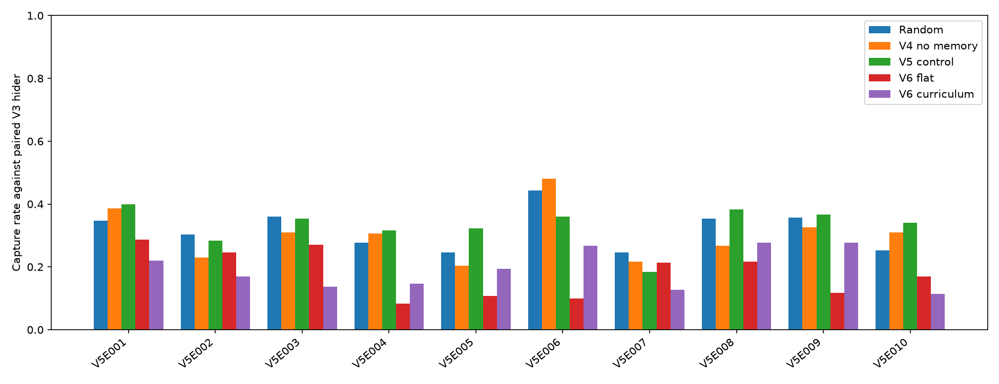
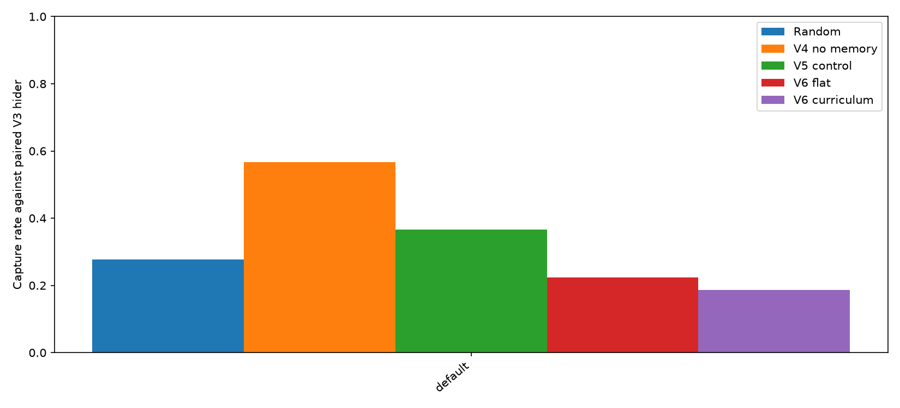

# Hide-and-Seek RL V6 — หลักสูตรแผนที่และคู่แข่งหลายตัว

## คำถามและขอบเขต

V5 Control จับ Hider V3 บนแผนที่ใหม่ V5E ได้ 993/3,000 เกม แต่บนแผนที่เดิมเหลือ 110/300 เกม การทดลอง V6 จึงทดสอบว่าการค่อยเพิ่มแผนที่ช่วยรักษาความสามารถและเพิ่มผลบนแผนที่ใหม่หรือไม่ เมื่อฝึกกับ Hider หลายตัว

[แผนและเกณฑ์ V6](v6_protocol.md) ถูกบันทึกใน commit `aafd95c` ก่อนฝึกและเปิดผล คำตัดสินจาก validation และ default ถูกล็อกใน commit `fe784ab` ก่อนเปิด V5F ผลด้านล่างรักษาเกณฑ์เดิมแม้สมมติฐานไม่สำเร็จ

## วิธีทดลอง

ฝึก PPO Seeker แบบไม่มี visit memory จากน้ำหนัก V4 no-memory ของ seed เดียวกันด้วย optimizer ใหม่ 3 seed (41–43) × 2 แขน:

| ช่วงฝึก | ก้าวที่ร้องขอ | `flat` แผนที่ไม่ซ้ำ | `curriculum` แผนที่ไม่ซ้ำ |
| --- | ---: | ---: | ---: |
| 1 | 50,000 | 108 | 28 |
| 2 | 50,000 | 108 | 58 |
| 3 | 100,000 | 108 | 108 |

ทั้งสองแขนใช้แผนที่ V5T 100 แผนที่และแผนที่เดิม 8 แผนที่ในช่วงสุดท้าย มีรายการซ้ำของ default และ F1 ตาม V5 เหมือนกัน ทุก episode เลือกหนึ่งตัวจาก Hider สุ่มและ Hider V3 seed 41, 42, 43 ด้วยโอกาสเท่ากัน แล้วตรึงตัวนั้นจนจบเกม ไม่ใช้โมเดล Hider V2 เพราะ observation คนละขนาด

แต่ละโมเดลฝึกจริง **200,704 ก้าว** (50,176 + 50,176 + 100,352 หลัง PPO ปัดจำนวนก้าวต่อ rollout) ทั้งหกโมเดลและ log รายช่วงอยู่ใน `models/seeker_v6_*` และ `results/v6_seed*` ตามลำดับ `env/hide_seek_v6_env.py` เพิ่มการเลือกคู่แข่งต่อ episode โดยคงกติกา V4 ส่วน `training/train_v6.py` ควบคุมสองแขนนี้

ตอนประเมินใช้ Hider V3 seed ที่จับคู่กับ training seed, จุดเริ่มเกมเดียวกันทุกคู่, และกรองทิศที่เดินได้ให้โมเดลที่เรียนรู้ทุกตัว ตัวสุ่มเลือก action ปกติเหมือนรายงาน V5 จึงอาจชนกำแพงได้ ผล V5 Control เป็นตัวเทียบเดิม ไม่ใช่ control สำหรับแยกผลของหลักสูตร เพราะ V5 ฝึกกับ Hider seed เดียว

## Validation บน V5E 10 แผนที่

ใช้ 100 เกมต่อแผนที่ต่อ training seed รวม 3,000 เกมต่อคู่ ใช้ eval seed เดียวกับ V5 ผลรายเกมอยู่ใน [CSV validation](../results/v6_validation_evaluation.csv)

| Seeker / Hider V3 | จับได้ | ช่องที่ไปถึงไม่ซ้ำเฉลี่ย | seed 41 / 42 / 43 |
| --- | ---: | ---: | ---: |
| สุ่ม | 956/3,000 (31.9%) | 15.09 | 326 / 311 / 319 |
| V4 ไม่มีความจำ | 911/3,000 (30.4%) | 4.94 | 247 / 332 / 332 |
| V5 Control | 993/3,000 (33.1%) | 4.83 | 282 / 356 / 355 |
| V6 `flat` | 543/3,000 (18.1%) | 4.74 | 247 / 163 / 133 |
| V6 `curriculum` | 578/3,000 (19.3%) | 4.83 | 171 / 187 / 220 |

`curriculum` สูงกว่า `flat` 35/3,000 เกม หรือ 1.2 จุดเปอร์เซ็นต์ ต่ำกว่าเกณฑ์ 2 จุดเปอร์เซ็นต์ และต่ำกว่า V5 Control 415 เกม แม้จะชนะ `flat` ใน 2 จาก 3 seed ก็ตาม บน V5E006 ซึ่งตัวสุ่มจับได้ 133/300 เกม `flat` จับได้ 30/300 และ `curriculum` 80/300; ผลตกลงหลายแผนที่ ไม่ได้เกิดจากแผนที่เดียว



## Regression บนแผนที่เดิม

ใช้ 100 เกมต่อ training seed รวม 300 เกมต่อคู่ ผลรายเกมอยู่ใน [CSV default](../results/v6_default_evaluation.csv)

| Seeker / Hider V3 | จับได้ | ช่องที่ไปถึงไม่ซ้ำเฉลี่ย |
| --- | ---: | ---: |
| สุ่ม | 83/300 (27.7%) | 16.50 |
| V4 ไม่มีความจำ | 170/300 (56.7%) | 6.85 |
| V5 Control | 110/300 (36.7%) | 6.26 |
| V6 `flat` | 67/300 (22.3%) | 5.49 |
| V6 `curriculum` | 56/300 (18.7%) | 5.14 |

เกณฑ์อนุญาตให้ `curriculum` ต่ำกว่า V4 ได้ไม่เกิน 5 จุดเปอร์เซ็นต์ หรืออย่างน้อย 155/300 เกม แต่ได้เพียง 56/300 เกม จึงไม่ผ่านอย่างชัดเจน ผล V4/V5 และตัวสุ่มตรงกับการประเมิน V5 เดิมเพราะใช้ seed เดียวกัน



## คำตัดสินก่อนเปิดชุดสุดท้าย

ไฟล์ [v6_selection.json](../results/v6_selection.json) บันทึกผลว่า `selection: null` ซึ่งหมายถึง **ไม่มีโมเดล V6 ที่ผ่านเกณฑ์เพื่อเลื่อนใช้** ไฟล์นี้เก็บ hash ของผล validation, default และทั้งหกโมเดล คำสั่งเปิด V5F จะตรวจ hash ก่อนและไม่ยอมประเมินซ้ำในที่เดิม

## ชุดสุดท้าย V5F 20 แผนที่

หลังล็อกคำตัดสินแล้ว จึงเปิด V5F ครั้งเดียวด้วย eval seed ช่วง 800000–990099 แยกตามแผนที่ 100 เกมต่อแผนที่ต่อ training seed รวม **6,000 เกมต่อคู่** ผลนี้ใช้วินิจฉัยเท่านั้น เพราะไม่มีตัวเลือก V6 ผ่าน validation ผลรายเกมอยู่ใน [CSV ชุดสุดท้าย](../results/v6_final_evaluation.csv)

| Seeker / Hider V3 | จับได้ | ช่องที่ไปถึงไม่ซ้ำเฉลี่ย | seed 41 / 42 / 43 | แผนที่ที่ไม่ต่ำกว่าตัวสุ่ม |
| --- | ---: | ---: | ---: | ---: |
| สุ่ม | 1,814/6,000 (30.2%) | 14.61 | 619 / 600 / 595 | 20/20 |
| V4 ไม่มีความจำ | 1,613/6,000 (26.9%) | 4.88 | 432 / 565 / 616 | 6/20 |
| V5 Control | 1,815/6,000 (30.2%) | 4.68 | 586 / 588 / 641 | 10/20 |
| V6 `flat` | 1,120/6,000 (18.7%) | 4.62 | 421 / 401 / 298 | 0/20 |
| V6 `curriculum` | 1,257/6,000 (20.9%) | 4.69 | 319 / 475 / 463 | 2/20 |

`curriculum` ต่ำกว่าตัวสุ่ม 557/6,000 เกม หรือ 9.3 จุดเปอร์เซ็นต์ และไม่สูงกว่าตัวสุ่มใน seed ใดเลย มีเพียง V5F006 ที่สูงกว่า (118 เทียบ 96 เกม) กับ V5F017 ที่เท่ากัน (97 เกม) จาก 20 แผนที่ ผลนี้ไม่ถึงเป้าหมายที่กำหนดไว้: สูงกว่าตัวสุ่ม 10 จุดเปอร์เซ็นต์, อย่างน้อย 12/20 แผนที่ไม่ต่ำกว่าตัวสุ่ม, และสูงกว่าในอย่างน้อย 2/3 seed


## ข้อสรุปและข้อจำกัด

- การค่อยเพิ่มแผนที่ภายใต้งบและคู่แข่ง pool นี้ไม่เพิ่มอัตราจับตามเกณฑ์ validation และไม่รักษาผลงานบนแผนที่เดิม โมเดล V6 ทั้งสองแขนจึงเก็บเป็นผลทดลอง ไม่แทนโมเดลก่อนหน้า
- บน V5F โมเดล V6 ไปถึงเพียงประมาณ 4.6–4.7 ช่องต่อเกม เทียบกับตัวสุ่ม 14.6 ช่อง แม้โมเดลที่เรียนรู้ไม่เดินชนกำแพงตอนประเมินเลย จำนวนช่องที่เข้าถึงต่ำเป็นหลักฐานว่าพฤติกรรมค้นหายังจำกัด แต่ข้อมูลนี้ยังไม่ระบุสาเหตุภายในของนโยบาย
- Hider ในการประเมินเป็น V3 seed ที่จับคู่ ไม่ใช่คู่แข่งรุ่นใหม่ที่ไม่เคยเห็น การอ้างอิงความแข็งแรงจึงจำกัดที่แผนที่ใหม่และ Hider กลุ่มนี้
- V5F ถูกเปิดใช้แล้ว งานทดลองครั้งต่อไปต้องกันแผนที่ใหม่อีกชุดก่อนปรับวิธีฝึกหรือเลือกโมเดล อย่านำ V5F กลับมาเรียกว่า final holdout ที่ไม่เคยเห็น

## ทำซ้ำ

รีโปมีโมเดลและผล CSV ที่รันจริงแล้ว ตรวจโค้ดและข้อมูลได้ด้วย `python -m unittest discover -s tests -q` หากต้องการประเมินซ้ำจากโมเดลที่บันทึกไว้ ให้เขียนผลลงโฟลเดอร์ใหม่เพื่อคงหลักฐาน V5F ที่เปิดครั้งแรก:

```bash
python -m evaluation.evaluate_v6 --partition validation --output-dir /tmp/hideseek-v6-recheck
python -m evaluation.evaluate_v6 --partition default --output-dir /tmp/hideseek-v6-recheck
python -m evaluation.evaluate_v6 --partition lock --output-dir /tmp/hideseek-v6-recheck
python -m evaluation.evaluate_v6 --partition final --output-dir /tmp/hideseek-v6-recheck
```

การรันซ้ำนี้เป็นการยืนยันผลด้วยโมเดลเดิม ไม่ทำให้ V5F กลับมาเป็นข้อมูลที่ไม่เคยเปิด
